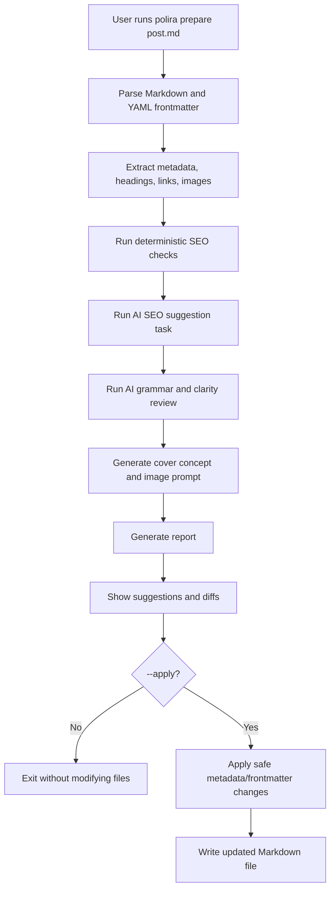
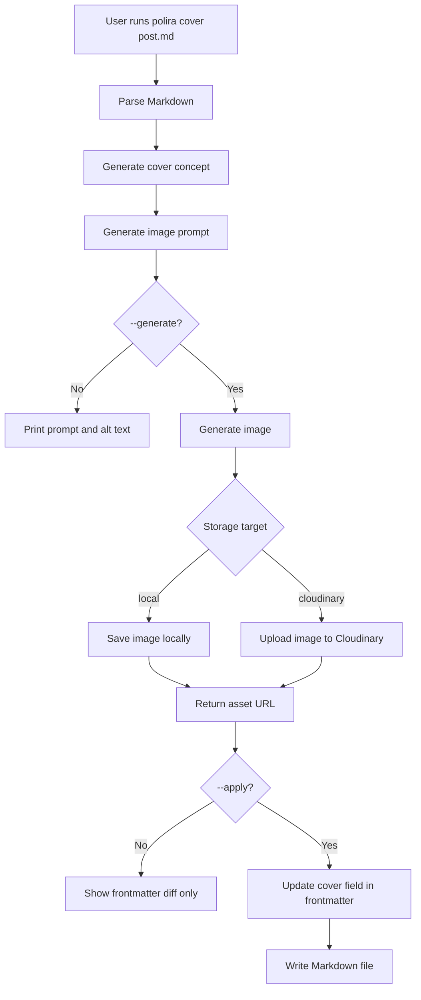
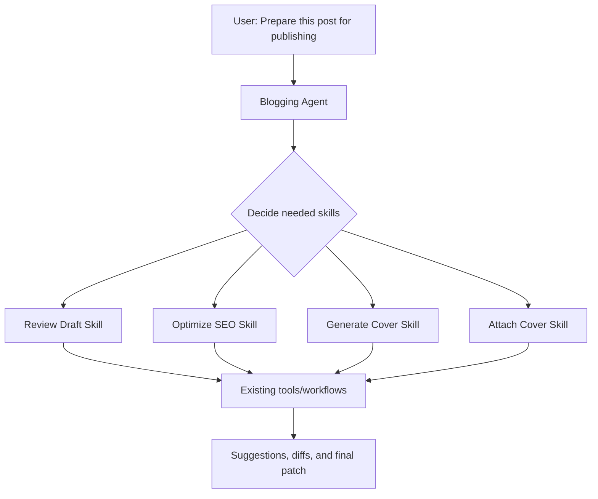

# Polira — MVP Project Brief

## 1. Project Overview

### Project name

**Polira**

### Tagline

Make Markdown drafts publish-ready.

### Name rationale

Polira is inspired by the idea of polishing and refining a draft before it goes live. The name is short, memorable, and professional while still feeling less plain than a purely functional CLI name.

### MVP positioning

**Polira** is a workflow-driven AI assistant for preparing Markdown blog drafts for publishing.

The MVP should **not** behave as a fully autonomous AI agent yet. Instead, it should provide a deterministic, CLI-first workflow that uses AI-powered tools for specific tasks such as grammar review, SEO suggestions, and blog cover prompt generation.

The architecture should be designed so these workflow components can later be exposed as reusable **agent skills**, MCP tools, or VS Code extension commands.

---

## 2. Goal

The goal of the MVP is to help writers take an existing Markdown blog draft and prepare it for publishing by:

1. Parsing Markdown content and YAML frontmatter.
2. Reviewing metadata for SEO quality.
3. Reviewing the article body for grammar, clarity, and diction improvements.
4. Generating a cover image concept and image prompt based on metadata and content.
5. Generating a cover image using an image generation provider.
6. Saving the generated cover locally or uploading it to Cloudinary.
7. Updating the Markdown frontmatter with the generated image path or URL.
8. Showing clear before/after diffs before applying changes.

The MVP should prioritize **reviewable suggestions and deterministic file changes** over autonomous rewriting.

---

## 3. Non-Goals for MVP

The MVP should not include:

- A full web application.
- Multi-user accounts.
- Authentication.
- Publishing directly to Dev.to, Hashnode, Medium, or custom CMS platforms.
- Background jobs or scheduling.
- Full article generation from scratch.
- Fully autonomous edit/apply behavior without user confirmation.
- Complex analytics.
- Collaboration features.
- GitHub Action integration.
- VS Code extension UI.
- MCP server implementation.

These can be added later after the CLI workflow is stable.

---

## 4. Target Users

Primary users:

- Technical bloggers.
- Developer advocates.
- Indie hackers.
- Engineers writing Markdown-based blogs.
- Writers using static-site generators or content frameworks.

Supported blogging formats should include, but not be limited to:

- Astro content collections.
- Nuxt Content.
- Jekyll.
- Hugo.
- Eleventy.
- Custom Markdown blogs.
- Dev.to-style Markdown drafts.

---

## 5. Core Product Principles

### 5.1 Review before apply

The tool should show suggestions and diffs before modifying files.

Default behavior should be dry-run/review mode.

Use `--apply` to write changes.

### 5.2 Preserve writer voice

Grammar and writing suggestions should improve quality without aggressively rewriting the article.

Default writing mode should be `light` or `medium`, not `strong`.

### 5.3 Deterministic where possible

Use normal code for deterministic tasks:

- Parsing Markdown.
- Reading frontmatter.
- Validating missing fields.
- Updating frontmatter.
- Generating diffs.
- Uploading assets.
- Saving files.

Use AI only where it adds real value:

- Grammar/style review.
- SEO suggestions.
- Cover concept generation.
- Cover image prompt generation.
- Alt text generation.

### 5.4 Clean separation between tools, workflows, and future skills

Use this mental model:

```text
Tools      = atomic capabilities
Workflows  = predictable product flows
Skills     = future agent-facing wrappers around tools/workflows
Agents     = future decision-makers that choose skills dynamically
```

For MVP, implement `tools/` and `workflows/`.

Add `skills/` and `agents/` later when exposing the same logic to agentic runtimes.

---

## 6. MVP Features

## 6.1 Markdown and YAML frontmatter parsing

The CLI should accept a Markdown file path and parse:

- YAML frontmatter.
- Markdown body.
- Title.
- Description.
- Tags.
- Slug.
- Existing cover image field.
- Headings.
- Links.
- Images.

Example command:

```bash
polira analyze ./posts/my-post.md
```

Expected behavior:

- Read the file.
- Extract frontmatter.
- Extract Markdown body.
- Return a structured internal `BlogDraft` object.
- Print a readable analysis summary.

---

## 6.2 SEO metadata review

The tool should review SEO-related metadata and suggest improvements.

Fields to inspect:

- `title`
- `description`
- `slug`
- `tags`
- `cover` / `image` / `heroImage` / configurable cover field
- headings
- content summary

Checks should include:

- Missing title.
- Title too short or too vague.
- Missing description.
- Description too short or too long.
- Missing slug.
- Weak slug formatting.
- Missing or weak tags.
- Missing cover image.
- Missing H1/H2 structure.
- Missing image alt text.

Some checks should be deterministic. AI can be used for qualitative suggestions.

Example command:

```bash
polira seo ./posts/my-post.md
```

---

## 6.3 Grammar, clarity, and diction review

The tool should review the Markdown body and suggest writing improvements.

Modes:

```text
light   = grammar, spelling, punctuation
medium  = grammar, clarity, sentence flow
strong  = larger readability rewrites
```

Default mode:

```text
medium
```

The tool should produce structured suggestions with:

- Original text.
- Suggested text.
- Category.
- Reason.
- Confidence.

Example command:

```bash
polira review ./posts/my-post.md
```

Example with mode:

```bash
polira review ./posts/my-post.md --mode light
```

---

## 6.4 Diff preview

The MVP should show before/after diffs for suggested text or frontmatter changes.

Example:

```diff
- This approach make data fetching more easier.
+ This approach makes data fetching easier.
```

The tool should support:

```bash
polira fix ./posts/my-post.md
```

This shows suggestions and a diff but does not write changes.

```bash
polira fix ./posts/my-post.md --apply
```

This applies accepted or safe changes.

For MVP, it is acceptable to apply only structured metadata/frontmatter updates and avoid automatic body rewriting unless explicitly enabled.

---

## 6.5 Cover image concept and prompt generation

The tool should generate a cover image concept from:

- Title.
- Description.
- Tags.
- Slug.
- Markdown body summary.
- Optional brand/style configuration.

The output should include:

- Visual concept.
- Image generation prompt.
- Suggested filename.
- Suggested alt text.

Example command:

```bash
polira cover ./posts/my-post.md --prompt-only
```

Expected output:

```text
Visual concept:
A clean developer workspace with floating UI cards representing cache, queries, and async states.

Image prompt:
Create a modern editorial blog cover illustration for a technical article about TanStack Query in Vue...

Alt text:
Illustration of a developer workflow showing data fetching, caching, and UI state updates.

Suggested filename:
tanstack-query-vue-data-fetching-cover.png
```

---

## 6.6 Cover image generation

The tool should generate a cover image using a pluggable image provider.

The MVP provider can reuse the existing CoCover VS Code Extension logic where relevant.

Provider abstraction:

```ts
interface ImageGenerationProvider {
  generateImage(input: GenerateImageInput): Promise<GeneratedImage>;
}
```

The provider should return either:

- A local file path.
- A buffer.
- A base64-encoded image.
- Provider metadata.

Example command:

```bash
polira cover ./posts/my-post.md --generate
```

---

## 6.7 Save cover locally

The MVP should support saving the generated image locally.

Example command:

```bash
polira cover ./posts/my-post.md --generate --save local
```

Default local output:

```text
./public/images/blog/{suggestedFilename}
```

This should be configurable.

---

## 6.8 Upload cover to Cloudinary

The MVP should support optional Cloudinary upload.

Example command:

```bash
polira cover ./posts/my-post.md --generate --upload cloudinary
```

Required environment variables:

```bash
CLOUDINARY_CLOUD_NAME=
CLOUDINARY_API_KEY=
CLOUDINARY_API_SECRET=
```

The upload tool should return:

- URL.
- Secure URL.
- Public ID.
- Width.
- Height.
- Format.
- Bytes.

---

## 6.9 Update Markdown frontmatter with cover image

The tool should update the draft frontmatter with the image path or URL.

Example:

```yaml
title: Using TanStack Query in Vue
description: Learn how to simplify data fetching and caching in Vue apps.
tags:
  - vue
  - tanstack-query
  - frontend
cover: https://res.cloudinary.com/example/image/upload/blog/tanstack-query-vue-cover.png
```

Example command:

```bash
polira cover ./posts/my-post.md --generate --upload cloudinary --apply
```

Important:

- Do not write changes unless `--apply` is provided.
- Show the frontmatter diff before applying.
- Preserve existing frontmatter fields where possible.
- Support a configurable cover field name.

Supported default cover field candidates:

```text
cover
image
heroImage
ogImage
thumbnail
```

---

## 6.10 Prepare draft workflow

The main MVP command should run the full publish-preparation workflow.

Example:

```bash
polira prepare ./posts/my-post.md
```

Default behavior:

1. Parse draft.
2. Review SEO metadata.
3. Review grammar/style.
4. Generate cover concept and prompt.
5. Print suggested changes.
6. Show diffs.
7. Do not write files.

Apply behavior:

```bash
polira prepare ./posts/my-post.md --generate-cover --upload cloudinary --apply
```

This may:

1. Generate cover image.
2. Upload cover.
3. Update frontmatter.
4. Optionally apply safe metadata fixes.

Body text rewriting should remain conservative in the MVP.

---

## 7. CLI Commands

Recommended CLI name:

```bash
polira
```

### 7.1 Analyze command

```bash
polira analyze <file>
```

Purpose:

- Parse Markdown.
- Print metadata summary.
- Print detected headings, links, images, and missing fields.

---

### 7.2 SEO command

```bash
polira seo <file>
```

Purpose:

- Review SEO metadata.
- Suggest title, description, slug, tags, and structure improvements.

Options:

```bash
--json
--apply
```

---

### 7.3 Review command

```bash
polira review <file>
```

Purpose:

- Review writing quality.
- Suggest grammar, clarity, and diction improvements.

Options:

```bash
--mode light|medium|strong
--json
```

---

### 7.4 Fix command

```bash
polira fix <file>
```

Purpose:

- Generate suggested changes.
- Show diff.
- Optionally apply safe fixes.

Options:

```bash
--apply
--mode light|medium|strong
```

---

### 7.5 Cover command

```bash
polira cover <file>
```

Purpose:

- Generate cover concept.
- Generate image prompt.
- Optionally generate image.
- Optionally save or upload.
- Optionally update frontmatter.

Options:

```bash
--prompt-only
--generate
--save local
--upload cloudinary
--apply
--size 1792x1024
```

---

### 7.6 Prepare command

```bash
polira prepare <file>
```

Purpose:

- Run the full publish-preparation workflow.

Options:

```bash
--generate-cover
--upload cloudinary|none
--save local|none
--apply
--mode light|medium|strong
--json
```

---

## 8. Recommended Tech Stack

### Runtime

- Node.js
- TypeScript

### CLI framework

Recommended:

- `commander`

Alternative:

- `oclif`

For MVP, prefer `commander` because it is simpler and faster to set up.

### Markdown parsing

Recommended packages:

- `gray-matter` for YAML frontmatter.
- `unified` ecosystem for Markdown parsing.
- `remark-parse` for Markdown AST.
- `remark-stringify` if AST-based writing becomes necessary.

### YAML

- `gray-matter`
- `yaml` if more control is needed.

### Diff output

- `diff` or `jsdiff`

### Cloudinary

- `cloudinary` Node SDK

### AI provider

Use an internal provider abstraction.

Initial provider:

- OpenAI API-compatible provider for GPT-5.5 text tasks.
- Image generation provider reusing CoCover logic where possible.

Do not hard-code provider logic deeply into workflows.

### Validation

Recommended:

- `zod`

Use `zod` for:

- Config validation.
- Tool input validation.
- Tool output validation.
- AI structured output parsing.

### Testing

Recommended:

- `vitest`

Test fixtures:

- Valid post.
- Missing metadata.
- Existing cover image.
- Invalid frontmatter.
- Post with images.
- Post with no headings.

### Formatting and linting

Recommended:

- `eslint`
- `prettier`
- `tsx` for local TypeScript execution during development.

---

## 9. Basic Architecture

### 9.1 Architecture layers

```text
CLI Commands
    ↓
Workflows
    ↓
Tools
    ↓
Providers
    ↓
External APIs / File System
```

### 9.2 Layer responsibilities

#### CLI commands

Responsible for:

- Parsing command arguments.
- Loading config.
- Calling workflows.
- Printing human-readable output.
- Setting process exit code.

CLI commands should not contain business logic.

#### Workflows

Responsible for composing tools into product flows.

Examples:

- `reviewDraftWorkflow`
- `generateAndAttachCoverWorkflow`
- `prepareDraftWorkflow`

#### Tools

Atomic capabilities.

Examples:

- `parseMarkdownTool`
- `reviewSeoTool`
- `reviewWritingTool`
- `generateCoverPromptTool`
- `generateImageTool`
- `uploadAssetTool`
- `updateFrontmatterTool`
- `generateDiffTool`

#### Providers

Adapters for external systems.

Examples:

- OpenAI text provider.
- OpenAI/image generation provider.
- Cloudinary storage provider.
- Local filesystem storage provider.

#### Future skills

Future agent-facing wrappers around workflows or tools.

Example:

```text
skills/generate-cover.skill.ts
```

This can call:

```text
workflows/generate-and-attach-cover.ts
```

---

## 10. Flow Diagrams

## 10.1 MVP prepare workflow



## 10.2 Generate and attach cover workflow



## 10.3 Future agentic architecture



---

## 11. Core Types

Create central types in:

```text
src/core/types.ts
```

### 11.1 BlogDraft

```ts
export type BlogDraft = {
  filePath: string;
  rawContent: string;
  frontmatter: BlogFrontmatter;
  markdownBody: string;
  metadata: DraftMetadata;
};
```

### 11.2 BlogFrontmatter

```ts
export type BlogFrontmatter = {
  title?: string;
  description?: string;
  slug?: string;
  tags?: string[];
  date?: string;
  cover?: string;
  image?: string;
  heroImage?: string;
  ogImage?: string;
  thumbnail?: string;
  canonical?: string;
  draft?: boolean;
  [key: string]: unknown;
};
```

### 11.3 DraftMetadata

```ts
export type DraftMetadata = {
  title?: string;
  description?: string;
  slug?: string;
  tags: string[];
  coverImage?: string;
  headings: MarkdownHeading[];
  links: MarkdownLink[];
  images: MarkdownImage[];
  wordCount: number;
  estimatedReadingTimeMinutes: number;
};
```

### 11.4 MarkdownHeading

```ts
export type MarkdownHeading = {
  depth: number;
  text: string;
};
```

### 11.5 MarkdownLink

```ts
export type MarkdownLink = {
  text: string;
  url: string;
};
```

### 11.6 MarkdownImage

```ts
export type MarkdownImage = {
  alt?: string;
  url: string;
  title?: string;
};
```

### 11.7 SEO suggestion

```ts
export type SeoSuggestion = {
  field:
    | 'title'
    | 'description'
    | 'slug'
    | 'tags'
    | 'headings'
    | 'cover'
    | 'content'
    | 'images';
  severity: 'info' | 'warning' | 'critical';
  current?: string | string[];
  suggested?: string | string[];
  reason: string;
  source: 'deterministic' | 'ai';
};
```

### 11.8 Writing suggestion

```ts
export type WritingSuggestion = {
  original: string;
  suggestion: string;
  reason: string;
  category: 'grammar' | 'clarity' | 'tone' | 'structure' | 'diction';
  confidence: number;
};
```

### 11.9 Cover prompt result

```ts
export type CoverPromptResult = {
  visualConcept: string;
  prompt: string;
  altText: string;
  suggestedFilename: string;
};
```

### 11.10 Generated image

```ts
export type GeneratedImage = {
  fileName: string;
  mimeType: string;
  buffer?: Buffer;
  base64?: string;
  localPath?: string;
  providerMetadata?: Record<string, unknown>;
};
```

### 11.11 Uploaded asset

```ts
export type UploadedAsset = {
  provider: 'cloudinary' | 'local';
  url: string;
  secureUrl?: string;
  publicId?: string;
  localPath?: string;
  width?: number;
  height?: number;
  format?: string;
  bytes?: number;
  metadata?: Record<string, unknown>;
};
```

### 11.12 Draft patch

```ts
export type DraftPatch = {
  filePath: string;
  originalContent: string;
  updatedContent: string;
  diff: string;
  changes: DraftChange[];
};
```

### 11.13 Draft change

```ts
export type DraftChange = {
  type: 'frontmatter' | 'body';
  field?: string;
  original?: unknown;
  updated?: unknown;
  reason?: string;
};
```

### 11.14 Tool interface

```ts
export type Tool<TInput, TOutput> = {
  name: string;
  description: string;
  run(input: TInput): Promise<TOutput>;
};
```

---

## 12. Provider Interfaces

Create provider interfaces in:

```text
src/core/providers.ts
```

### 12.1 Text AI provider

```ts
export type TextAIProvider = {
  generateStructuredOutput<TOutput>(input: {
    systemPrompt: string;
    userPrompt: string;
    schemaName: string;
  }): Promise<TOutput>;
};
```

### 12.2 Image generation provider

```ts
export type GenerateImageInput = {
  prompt: string;
  fileName: string;
  size?: '1024x1024' | '1536x1024' | '1792x1024';
};

export type ImageGenerationProvider = {
  generateImage(input: GenerateImageInput): Promise<GeneratedImage>;
};
```

### 12.3 Asset storage provider

```ts
export type AssetStorageProvider = {
  upload(image: GeneratedImage): Promise<UploadedAsset>;
};
```

---

## 13. Configuration

Support a config file:

```text
polira.config.ts
```

Example:

```ts
import type { PoliraConfig } from './src/core/config';

const config: PoliraConfig = {
  ai: {
    provider: 'openai',
    textModel: 'gpt-5.5',
    imageModel: 'image-generation-default',
  },
  markdown: {
    coverField: 'cover',
    preserveFrontmatterOrder: true,
  },
  writing: {
    defaultMode: 'medium',
  },
  image: {
    size: '1792x1024',
    style: 'modern editorial illustration',
  },
  storage: {
    provider: 'local',
    local: {
      outputDir: './public/images/blog',
      publicPathPrefix: '/images/blog',
    },
    cloudinary: {
      folder: 'blog-covers',
    },
  },
};

export default config;
```

Type:

```ts
export type PoliraConfig = {
  ai: {
    provider: 'openai';
    textModel: string;
    imageModel?: string;
  };
  markdown: {
    coverField: 'cover' | 'image' | 'heroImage' | 'ogImage' | 'thumbnail';
    preserveFrontmatterOrder?: boolean;
  };
  writing: {
    defaultMode: 'light' | 'medium' | 'strong';
  };
  image: {
    size: '1024x1024' | '1536x1024' | '1792x1024';
    style?: string;
  };
  storage: {
    provider: 'local' | 'cloudinary';
    local?: {
      outputDir: string;
      publicPathPrefix: string;
    };
    cloudinary?: {
      folder: string;
    };
  };
};
```

---

## 14. Environment Variables

Use `.env` for local development.

```bash
OPENAI_API_KEY=
CLOUDINARY_CLOUD_NAME=
CLOUDINARY_API_KEY=
CLOUDINARY_API_SECRET=
```

Do not commit `.env`.

Create `.env.example`:

```bash
OPENAI_API_KEY=
CLOUDINARY_CLOUD_NAME=
CLOUDINARY_API_KEY=
CLOUDINARY_API_SECRET=
```

---

## 15. Recommended Repo Structure

```text
polira/
  README.md
  package.json
  tsconfig.json
  .env.example
  .gitignore
  polira.config.ts

  src/
    cli/
      index.ts
      commands/
        analyze.ts
        seo.ts
        review.ts
        fix.ts
        cover.ts
        prepare.ts

    core/
      types.ts
      config.ts
      providers.ts
      tool.ts
      workflow.ts
      errors.ts
      logger.ts

    tools/
      parse-markdown/
        index.ts
        parseMarkdownTool.ts
        extractMetadata.ts

      review-seo/
        index.ts
        reviewSeoTool.ts
        deterministicSeoChecks.ts
        aiSeoReview.ts

      review-writing/
        index.ts
        reviewWritingTool.ts
        prompts.ts

      generate-cover-prompt/
        index.ts
        generateCoverPromptTool.ts
        prompts.ts

      generate-image/
        index.ts
        generateImageTool.ts

      upload-asset/
        index.ts
        uploadAssetTool.ts

      update-frontmatter/
        index.ts
        updateFrontmatterTool.ts

      generate-diff/
        index.ts
        generateDiffTool.ts

    workflows/
      analyzeDraftWorkflow.ts
      reviewDraftWorkflow.ts
      optimizeSeoWorkflow.ts
      generateAndAttachCoverWorkflow.ts
      prepareDraftWorkflow.ts

    providers/
      ai/
        openaiTextProvider.ts

      image/
        openaiImageProvider.ts
        cocoverImageProvider.ts

      storage/
        localStorageProvider.ts
        cloudinaryStorageProvider.ts

    utils/
      fileSystem.ts
      frontmatter.ts
      markdown.ts
      slug.ts
      readingTime.ts
      output.ts

  tests/
    fixtures/
      valid-post.md
      missing-meta.md
      existing-cover.md
      invalid-frontmatter.md
      post-with-images.md
      post-with-no-headings.md

    tools/
      parseMarkdownTool.test.ts
      deterministicSeoChecks.test.ts
      updateFrontmatterTool.test.ts
      generateDiffTool.test.ts

    workflows/
      prepareDraftWorkflow.test.ts
```

Future structure when adding agentic support:

```text
src/
  agents/
    bloggingAgent.ts
    planner.ts
    prompts.ts

  skills/
    blogging/
      reviewDraft.skill.ts
      optimizeSeo.skill.ts
      generateCover.skill.ts
      prepareForPublishing.skill.ts
```

Do not add `agents/` or `skills/` in MVP unless needed.

---

## 16. Tool Responsibilities

## 16.1 `parseMarkdownTool`

Input:

```ts
{
  filePath: string;
}
```

Output:

```ts
BlogDraft
```

Responsibilities:

- Read Markdown file.
- Parse frontmatter.
- Parse Markdown body.
- Extract metadata.
- Count words.
- Estimate reading time.
- Extract headings, links, and images.

---

## 16.2 `reviewSeoTool`

Input:

```ts
{
  draft: BlogDraft;
}
```

Output:

```ts
{
  suggestions: SeoSuggestion[];
}
```

Responsibilities:

- Run deterministic SEO checks.
- Call AI provider for qualitative SEO suggestions.
- Merge deterministic and AI suggestions.
- Return structured suggestions.

---

## 16.3 `reviewWritingTool`

Input:

```ts
{
  draft: BlogDraft;
  mode: 'light' | 'medium' | 'strong';
}
```

Output:

```ts
{
  suggestions: WritingSuggestion[];
}
```

Responsibilities:

- Review body text.
- Suggest grammar, clarity, and diction improvements.
- Return structured suggestions.
- Avoid rewriting the entire article by default.

---

## 16.4 `generateCoverPromptTool`

Input:

```ts
{
  draft: BlogDraft;
  style?: string;
}
```

Output:

```ts
CoverPromptResult
```

Responsibilities:

- Summarize article theme.
- Generate visual concept.
- Generate image prompt.
- Generate suggested alt text.
- Generate filename.

---

## 16.5 `generateImageTool`

Input:

```ts
{
  prompt: CoverPromptResult;
  size: '1024x1024' | '1536x1024' | '1792x1024';
}
```

Output:

```ts
GeneratedImage
```

Responsibilities:

- Call image generation provider.
- Return generated image object.
- Do not upload image.
- Do not update Markdown.

---

## 16.6 `uploadAssetTool`

Input:

```ts
{
  image: GeneratedImage;
  provider: 'local' | 'cloudinary';
}
```

Output:

```ts
UploadedAsset
```

Responsibilities:

- Save image locally or upload to Cloudinary.
- Return asset path or URL.
- Do not update Markdown.

---

## 16.7 `updateFrontmatterTool`

Input:

```ts
{
  draft: BlogDraft;
  updates: Record<string, unknown>;
  apply: boolean;
}
```

Output:

```ts
DraftPatch
```

Responsibilities:

- Patch frontmatter fields.
- Generate updated Markdown content.
- Generate diff.
- Write to disk only when `apply` is true.

---

## 16.8 `generateDiffTool`

Input:

```ts
{
  original: string;
  updated: string;
}
```

Output:

```ts
{
  diff: string;
}
```

Responsibilities:

- Produce a readable unified diff.

---

## 17. Workflow Responsibilities

## 17.1 `analyzeDraftWorkflow`

Steps:

1. Parse Markdown.
2. Return draft metadata summary.

---

## 17.2 `reviewDraftWorkflow`

Steps:

1. Parse Markdown.
2. Run writing review.
3. Return writing suggestions.

---

## 17.3 `optimizeSeoWorkflow`

Steps:

1. Parse Markdown.
2. Run SEO review.
3. Return SEO suggestions.
4. Optionally produce frontmatter patch.

---

## 17.4 `generateAndAttachCoverWorkflow`

Steps:

1. Parse Markdown.
2. Generate cover prompt.
3. Optionally generate image.
4. Optionally save or upload image.
5. Generate frontmatter patch.
6. Apply patch only when `apply` is true.

---

## 17.5 `prepareDraftWorkflow`

Steps:

1. Parse Markdown.
2. Run SEO review.
3. Run writing review.
4. Generate cover prompt.
5. Optionally generate and attach cover.
6. Show combined report.
7. Apply safe changes only when `apply` is true.

---

## 18. AI Prompting Guidelines

### 18.1 General rules

AI prompts should ask for structured JSON output.

Use schemas and validation.

Do not accept free-form AI output as final data without parsing and validation.

### 18.2 Writing review prompt behavior

The writing review prompt should instruct the model to:

- Preserve the writer’s tone.
- Avoid rewriting entire paragraphs unless necessary.
- Focus on grammar, clarity, diction, and readability.
- Return precise suggestions.
- Avoid generic feedback.
- Avoid changing code blocks.
- Avoid changing quoted text unless clearly wrong.

### 18.3 SEO prompt behavior

The SEO prompt should instruct the model to:

- Review the draft as a blog post.
- Suggest better metadata.
- Explain why each suggestion improves discoverability or clarity.
- Avoid clickbait.
- Keep title and description aligned with the actual content.
- Return structured suggestions.

### 18.4 Cover prompt behavior

The cover prompt task should instruct the model to:

- Create a visual concept based on the article’s actual topic.
- Avoid text-heavy image concepts.
- Avoid logos unless explicitly requested.
- Generate alt text.
- Generate a safe filename.
- Respect configured brand/style preferences.

---

## 19. Error Handling

Create typed errors for common failure cases:

```ts
export class BlogAgentError extends Error {
  constructor(
    message: string,
    public code: string,
    public cause?: unknown,
  ) {
    super(message);
  }
}
```

Recommended error codes:

```text
FILE_NOT_FOUND
INVALID_MARKDOWN
INVALID_FRONTMATTER
AI_PROVIDER_ERROR
IMAGE_GENERATION_FAILED
CLOUDINARY_UPLOAD_FAILED
CONFIG_NOT_FOUND
CONFIG_INVALID
PATCH_FAILED
WRITE_FAILED
```

CLI should print friendly messages.

Example:

```text
Could not parse frontmatter in ./posts/my-post.md.
Please check that the YAML block starts and ends with ---.
```

---

## 20. Security and Safety Considerations

### 20.1 File writes

Never write files unless `--apply` is provided.

### 20.2 Secrets

Do not print API keys or Cloudinary secrets.

### 20.3 External uploads

Cloudinary upload should require an explicit flag:

```bash
--upload cloudinary
```

### 20.4 AI changes

Do not silently apply large body rewrites.

### 20.5 Markdown code blocks

Avoid modifying code blocks during grammar review.

### 20.6 User content privacy

Warn in README that Markdown content may be sent to the configured AI provider for review unless a local provider is used in the future.

---

## 21. Testing Strategy

### Unit tests

Test:

- Markdown parsing.
- Frontmatter extraction.
- Metadata extraction.
- SEO deterministic checks.
- Frontmatter updates.
- Diff generation.
- Config loading.

### Integration tests

Test workflows with fixtures:

- Analyze draft.
- SEO review with mocked AI provider.
- Writing review with mocked AI provider.
- Generate cover prompt with mocked AI provider.
- Generate and attach cover with mocked image/storage providers.

### Provider tests

Mock external providers by default.

Do not call real AI or Cloudinary APIs in unit tests.

---

## 22. Example Fixture

Create:

```text
tests/fixtures/missing-meta.md
```

Content:

```markdown
---
title: TanStack Query in Vue
---

# TanStack Query in Vue

This post explain how TanStack Query can make data fetching more easier in Vue apps.

## Why it matters

Managing loading, errors, cache and refetching manually can become hard.
```

Expected SEO suggestions:

- Missing description.
- Missing tags.
- Missing slug.
- Missing cover image.

Expected writing suggestion:

```diff
- This post explain how TanStack Query can make data fetching more easier in Vue apps.
+ This post explains how TanStack Query can make data fetching easier in Vue apps.
```

---

## 23. Package Scripts

Recommended `package.json` scripts:

```json
{
  "scripts": {
    "dev": "tsx src/cli/index.ts",
    "build": "tsc",
    "test": "vitest run",
    "test:watch": "vitest",
    "lint": "eslint .",
    "format": "prettier --write .",
    "typecheck": "tsc --noEmit"
  }
}
```

Recommended package fields:

```json
{
  "type": "module",
  "bin": {
    "polira": "dist/cli/index.js"
  }
}
```

---

## 24. Suggested Dependencies

Runtime dependencies:

```bash
npm install commander gray-matter unified remark-parse remark-stringify zod diff cloudinary dotenv
```

Development dependencies:

```bash
npm install -D typescript tsx vitest eslint prettier @types/node
```

Add OpenAI SDK or compatible AI SDK according to the provider implementation:

```bash
npm install openai
```

---

## 25. Initial Implementation Order

### Step 1: Project setup

- Initialize TypeScript project.
- Add CLI entry.
- Add config loader.
- Add test setup.

### Step 2: Markdown parsing

- Implement `parseMarkdownTool`.
- Add fixtures.
- Add unit tests.

### Step 3: SEO deterministic checks

- Implement deterministic checks first.
- Add tests.

### Step 4: Diff and frontmatter patching

- Implement `generateDiffTool`.
- Implement `updateFrontmatterTool`.
- Add tests.

### Step 5: AI provider abstraction

- Define `TextAIProvider`.
- Add mocked provider for tests.
- Add OpenAI provider implementation.

### Step 6: Writing review and AI SEO suggestions

- Implement structured AI review tools.
- Validate output with `zod`.

### Step 7: Cover prompt generation

- Implement prompt generation.
- Return concept, prompt, alt text, filename.

### Step 8: Image generation and storage

- Implement image provider abstraction.
- Add local storage provider.
- Add Cloudinary provider.

### Step 9: Workflows

- Implement `prepareDraftWorkflow`.
- Implement `generateAndAttachCoverWorkflow`.

### Step 10: Polish CLI output

- Add readable terminal summaries.
- Add `--json` output option.
- Improve error handling.

---

## 26. Acceptance Criteria for MVP

The MVP is complete when:

1. A user can run:

```bash
polira analyze ./posts/example.md
```

and see parsed metadata and content structure.

2. A user can run:

```bash
polira seo ./posts/example.md
```

and receive useful SEO suggestions.

3. A user can run:

```bash
polira review ./posts/example.md
```

and receive grammar/clarity suggestions.

4. A user can run:

```bash
polira cover ./posts/example.md --prompt-only
```

and receive a cover concept, prompt, alt text, and filename.

5. A user can run:

```bash
polira cover ./posts/example.md --generate --save local --apply
```

and the tool saves a generated cover image locally and updates frontmatter.

6. A user can run:

```bash
polira cover ./posts/example.md --generate --upload cloudinary --apply
```

and the tool uploads the generated cover image to Cloudinary and updates frontmatter.

7. The tool does not write changes unless `--apply` is passed.

8. The project has unit tests for parsing, deterministic SEO checks, diff generation, and frontmatter patching.

9. AI providers and storage providers are abstracted so they can be replaced later.

10. The architecture can later support `skills/`, `agents/`, VS Code extension commands, or MCP tools without rewriting core logic.

---

## 27. Future Roadmap

### Phase 2: VS Code extension

Expose workflows as VS Code commands:

- Review current draft.
- Optimize SEO metadata.
- Generate cover image.
- Attach cover to frontmatter.
- Show suggestions in side panel.

### Phase 3: GitHub Action

Run on pull requests:

- Check blog drafts.
- Comment SEO suggestions.
- Comment grammar suggestions.
- Warn about missing cover images or metadata.

### Phase 4: Agentic mode

Add:

```text
src/agents/
src/skills/
```

Expose workflows as skills:

- `reviewDraftSkill`
- `optimizeSeoSkill`
- `generateCoverSkill`
- `prepareForPublishingSkill`

Agent behavior:

- Inspect draft.
- Decide which skills are needed.
- Ask for confirmation before file writes/uploads.
- Produce a publishing-readiness report.

### Phase 5: MCP server

Expose tools through MCP so other AI agents and editors can call them.

Potential MCP tools:

- `parse_blog_draft`
- `review_blog_seo`
- `review_blog_writing`
- `generate_blog_cover_prompt`
- `generate_blog_cover_image`
- `attach_cover_to_blog_draft`

---

## 28. Important Implementation Notes for Claude Code

When generating the boilerplate:

1. Use TypeScript.
2. Create a CLI-first project.
3. Keep business logic out of CLI command files.
4. Implement tools as isolated modules.
5. Implement workflows as composition layers.
6. Use provider interfaces for AI, image generation, and storage.
7. Add tests with mocked providers.
8. Do not implement a full autonomous agent in MVP.
9. Do not create web UI in MVP.
10. Do not hard-code Cloudinary as the only storage option.
11. Do not hard-code OpenAI deeply into workflows.
12. Do not write files unless `apply` is explicitly true.
13. Return structured data from tools and workflows.
14. Print user-friendly CLI output separately from core logic.
15. Preserve future ability to expose workflows as reusable agent skills.

---

## 29. Suggested README Summary

```markdown
# Polira

A CLI-first, workflow-driven AI assistant for preparing Markdown blog drafts for publishing.

It reviews your draft for grammar, clarity, and SEO metadata, generates a matching cover image concept, optionally creates and uploads the image, and updates your Markdown frontmatter with a reviewable diff.

## MVP Features

- Parse Markdown and YAML frontmatter
- Review SEO metadata
- Suggest grammar and clarity improvements
- Generate blog cover image prompts
- Generate cover images
- Save images locally or upload to Cloudinary
- Update Markdown frontmatter
- Show diffs before applying changes

## Usage

```bash
polira analyze ./posts/my-post.md
polira seo ./posts/my-post.md
polira review ./posts/my-post.md
polira cover ./posts/my-post.md --prompt-only
polira prepare ./posts/my-post.md
```

Use `--apply` to write changes.
```

---

## 30. Final Architecture Summary

The MVP should be implemented as:

```text
CLI-first TypeScript tool
    ↓
Workflow-driven architecture
    ↓
Modular tools
    ↓
Provider abstractions
    ↓
Future-ready for agent skills and MCP
```

Recommended framing:

> A workflow-driven AI assistant for preparing Markdown blog drafts for publishing, designed so its workflows can later be exposed as reusable agent skills.
